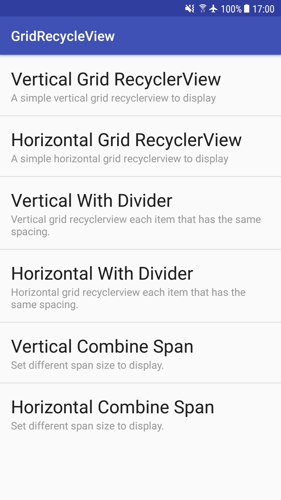

# recyclerview-grid-sample
An example of implementing grid recyclerview with vertical and horizontal kind.

### Feature
* Basic Vertical and Horizontal Recyclerview with GridLayoutManager.
* Vertical and Horizontal Grid Recyclerview with the same spacing.
* Vertical and Horizontal Grid Recyclerview with diff span size.

